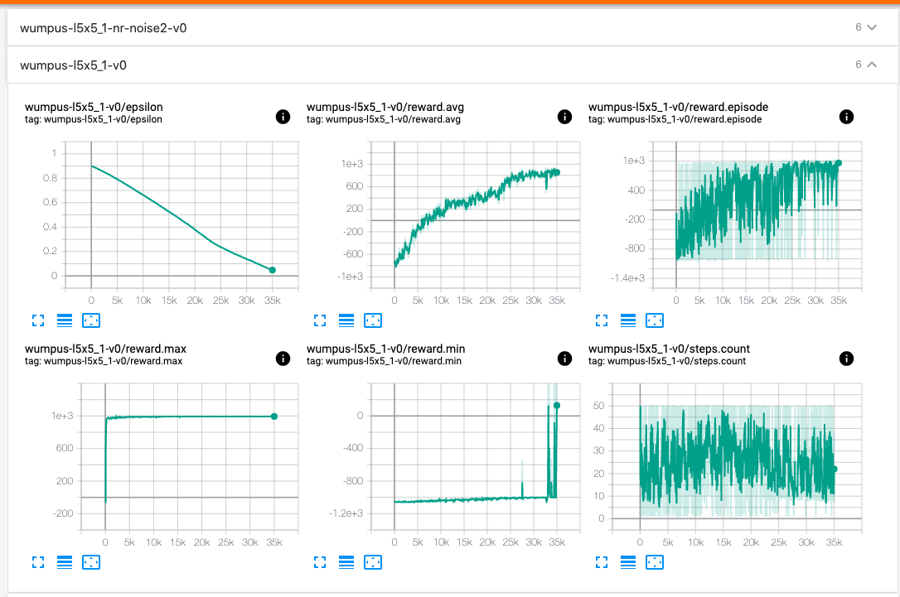
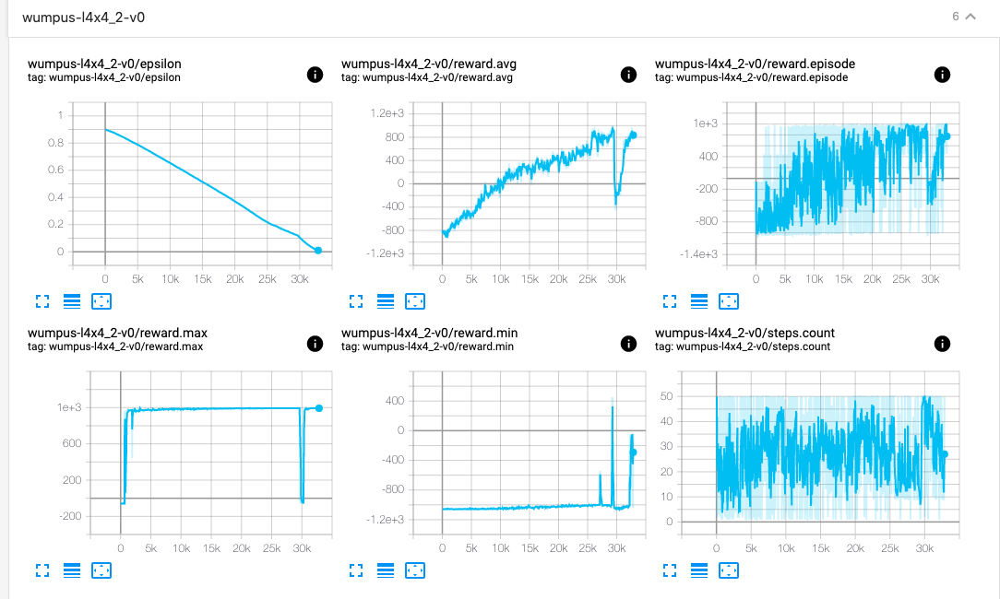

# Wumpus RL

The codebase consists of 2 parts:

1. Wumpus World environment ([gym-wumpus/](gym-wumpus/)) - compatible with [OpenAI Gym](https://gym.openai.com/)
    > This wraps around Code from [Project 3: Using Logic to Hunt the Wumpus](http://www.sista.arizona.edu/~clayton/courses/ai/projects/wumpus/)
2. DQN algorithm([dqn/](dqn/)) - for training Wumpus world environment

## Setup Python Environment

#### Create new environment with Python 3.7

```sh
conda create -n wumpus-rl python=3.7
conda activate wumpus-rl
```

#### Install packages

```sh
pip install -r requirements.txt
pip install -e gym-wumpus
```

## Using Wumpus Environment

* The sample code uses `wumpus-v0` environment that is defined inside `gym-wumpus/` folder. 
* This assumes you have already run `pip install -e gym-wumpus` command, which installs the wumpus world as a dependency inside the Python virtual environment.

#### Sample usage execution

```sh
>>> import gym_wumpus   # To be imported before `gym`
>>> import gym

>>> env = gym.make('wumpus-v0') # Initialize wumpus environment
>>> env.reset()
array([1, 1, 0, 0, 0, 0, 0, 0], dtype=uint32)

>>> env.render()
Scores: <Explorer>=0
  0   1   2   3   4   5    time_step=0
|---|---|---|---|---|---|
| # | # | # | # | # | # | 5
|---|---|---|---|---|---|
| # |   |   |   |   | # | 4
|---|---|---|---|---|---|
| # | W | G | P |   | # | 3
|---|---|---|---|---|---|
| # |   |   |   |   | # | 2
|---|---|---|---|---|---|
| # | ^ |   | P |   | # | 1
|---|---|---|---|---|---|
| # | # | # | # | # | # | 0
|---|---|---|---|---|---|

>>> env.step(2)  # Forward action
(array([1, 2, 0, 1, 0, 0, 0, 0], dtype=uint32), -1, False, {})

>>> env.render()
Scores: <Explorer>=-1
  0   1   2   3   4   5    time_step=1
|---|---|---|---|---|---|
| # | # | # | # | # | # | 5
|---|---|---|---|---|---|
| # |   |   |   |   | # | 4
|---|---|---|---|---|---|
| # | W | G | P |   | # | 3
|---|---|---|---|---|---|
| # | ^ |   |   |   | # | 2
|---|---|---|---|---|---|
| # |   |   | P |   | # | 1
|---|---|---|---|---|---|
| # | # | # | # | # | # | 0
|---|---|---|---|---|---|
```

#### Modifying `gym-wumpus` environment

* [`gym-wumpus/gym_wumpus/envs/wumpus_env.py`](gym-wumpus/gym_wumpus/envs/wumpus_env.py) - Defines the `gym.Env` class skeleton for Wumpus World environment. Modify the class to change the behavior.

Once modified, you can use the new enviornment in **two** ways:

1. Reinstall `gym-wumpus` package from the root of the repository

```sh
pip install -e gym-wumpus
```

2. Use the environment directly from the folder (no need to reinstall again and again)

```python
import sys
import gym
sys.path.append('gym-wumpus')  
# NOTE: This assumes you are running this in root of repository
# You can give relative paths or absolute path to `gym-wumpus` folder

from gym_wumpus.envs import WumpusWorld

env = WumpusWorld()

# You can use `env` object just as a regular `gym` environment
env.render()

# Pass `rgb_array` to the `render` method to get numpy array
# of the rendered image --> this can be used to generate GIFs
np_arr_img = env.render('rgb_array')
```

## Using DQN code

#### Files

* [`dqn/dqn.py`](dqn/dqn.py) - DQN Agent code
* [`dqn/utils.py`](dqn/utils.py) - Utility functions
* [`dqn/wumpus_dqn.py`](dqn/wumpus_dqn.py) - Training code for Wumpus world environment using DQN
* [`dqn/test_wumpus_dqn.py`](dqn/test_wumpus_dqn.py) - Testing code for Wumpus world environment with DQN, generates GIFs using checkpoints

#### Running code

* Run [`dqn/wumpus_dqn.py`](dqn/wumpus_dqn.py) file, 
* Give `env_id` (example, `wumpus-v0`) to `setup.sh` file
* Set `ENV_NAME` variable in `wumpus_dqn.py`

```
cd dqn
./setup.sh wumpus-v0
python wumpus_dqn.py
```

Run `clean.sh` to clear out the generated `logs`, `models`, and `tests`

```sh
./clean.sh
```

#### Hyperparameters

Change the hyperparameters inside [`dqn/wumpus_dqn.py`](dqn/wumpus_dqn.py) file

```python

...

EPISODES = 35000
...

agent = Agent(learning_rate=0.01, gamma=0.95,
              state_shape=env.observation_space.shape, actions=7,
              batch_size=64,
              epsilon_initial=0.9, epsilon_decay=1e-6, epsilon_final=0.01,
              replay_buffer_capacity=1000000,
              ...)

...

```

#### Testing an existing model

Test any environment using the pretrained existing models. Run `python test_wumpus_dqn.py <env_name>`. For example,

```sh
python test_wumpus.py wumpus-noise-v0
```

#### List of environments

| Environment                  | Noise (%) | Modified reward function (?) | Grid # |
|------------------------------|-----------|------------------------------|--------|
| `wumpus-v0`                  | 0         | Yes                          | 1      |
| `wumpus-nr-v0`               | 0         | No                           | 1      |
| `wumpus-noise2-v0`           | 10        | Yes                          | 1      |
| `wumpus-nr-noise2-v0`        | 10        | No                           | 1      |
| `wumpus-noise-v0`            | 20        | Yes                          | 1      |
| `wumpus-nr-noise-v0`         | 20        | No                           | 1      |
| `wumpus-l4x4_1-v0`           | 0         | Yes                          | 2      |
| `wumpus-l4x4_1-nr-v0`        | 0         | No                           | 2      |
| `wumpus-l4x4_1-noise2-v0`    | 10        | Yes                          | 2      |
| `wumpus-l4x4_1-nr-noise2-v0` | 10        | No                           | 2      |
| `wumpus-l4x4_1-noise-v0`     | 20        | Yes                          | 2      |
| `wumpus-l4x4_1-nr-noise-v0`  | 20        | No                           | 2      |
| `wumpus-l4x4_2-v0`           | 0         | Yes                          | 3      |
| `wumpus-l4x4_2-nr-v0`        | 0         | No                           | 3      |
| `wumpus-l4x4_2-noise2-v0`    | 10        | Yes                          | 3      |
| `wumpus-l4x4_2-nr-noise2-v0` | 10        | No                           | 3      |
| `wumpus-l4x4_2-noise-v0`     | 20        | Yes                          | 3      |
| `wumpus-l4x4_2-nr-noise-v0`  | 20        | No                           | 3      |
| `wumpus-l5x5_1-v0`           | 0         | Yes                          | 4      |
| `wumpus-l5x5_1-nr-v0`        | 0         | No                           | 4      |
| `wumpus-l5x5_1-noise2-v0`    | 10        | Yes                          | 4      |
| `wumpus-l5x5_1-nr-noise2-v0` | 10        | No                           | 4      |
| `wumpus-l5x5_1-noise-v0`     | 20        | Yes                          | 4      |
| `wumpus-l5x5_1-nr-noise-v0`  | 20        | No                           | 4      |

```
       GRID #1                            GRID #2
  0   1   2   3   4   5            0   1   2   3   4   5
|---|---|---|---|---|---|        |---|---|---|---|---|---|
| # | # | # | # | # | # | 5      | # | # | # | # | # | # | 5
|---|---|---|---|---|---|        |---|---|---|---|---|---|
| # |   |   |   |   | # | 4      | # |   |   |   |   | # | 4
|---|---|---|---|---|---|        |---|---|---|---|---|---|
| # | W | G | P |   | # | 3      | # | W | G |   |   | # | 3
|---|---|---|---|---|---|        |---|---|---|---|---|---|
| # |   |   |   |   | # | 2      | # |   | P |   |   | # | 2
|---|---|---|---|---|---|        |---|---|---|---|---|---|
| # | ^ |   | P |   | # | 1      | # | ^ |   | P |   | # | 1
|---|---|---|---|---|---|        |---|---|---|---|---|---|
| # | # | # | # | # | # | 0      | # | # | # | # | # | # | 0
|---|---|---|---|---|---|        |---|---|---|---|---|---|

       GRID #3                           GRID #4

  0   1   2   3   4   5          0   1   2   3   4   5   6
|---|---|---|---|---|---|        |---|---|---|---|---|---|---|
| # | # | # | # | # | # | 5      | # | # | # | # | # | # | # | 6  
|---|---|---|---|---|---|        |---|---|---|---|---|---|---|
| # |   |   | W | G | # | 4      | # |   | G |   |   |   | # | 5  
|---|---|---|---|---|---|        |---|---|---|---|---|---|---|
| # |   |   | P |   | # | 3      | # |   |   | W |   |   | # | 4
|---|---|---|---|---|---|        |---|---|---|---|---|---|---|
| # |   |   |   |   | # | 2      | # |   |   | P |   |   | # | 3  
|---|---|---|---|---|---|        |---|---|---|---|---|---|---|
| # | ^ |   |   | P | # | 1      | # |   |   |   |   |   | # | 2  
|---|---|---|---|---|---|        |---|---|---|---|---|---|---|
| # | # | # | # | # | # | 0      | # | ^ |   |   | P |   | # | 1  
|---|---|---|---|---|---|        |---|---|---|---|---|---|---|
                                 | # | # | # | # | # | # | # | 0
                                 |---|---|---|---|---|---|---|  
```

#### Tensorboard

During training, logs are generated in `dqn/logs/` folder. To view the Tensorboard, run the below command

```sh
tensorboard --logdir dqn/logs/
```


